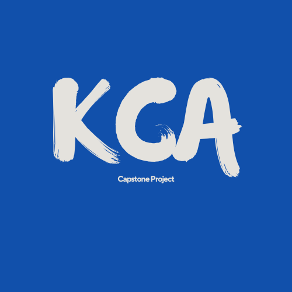

# 💸 NeuroFin: Capstone Project

> *Fintech Revolution for the Young Generation* 🚀

---

## 1. Overview
**NeuroFin** merupakan Proyek Capstone Program DicodingCamp 2025 yang dijalankan secara daring oleh tim beranggotakan 6 orang dari berbagai learning path (Front-End, Back-End, dan Machine Learning). Proyek ini berlangsung dari **10 Maret sampai 16 April 2025** dengan tujuan:
- 💡 **Meningkatkan kemampuan pemecahan masalah** melalui pengalaman belajar langsung.
- 🔍 **Menghadapi permasalahan dunia nyata** dengan solusi berbasis teknologi.
- 💰 **Menyediakan solusi inovatif** untuk pengelolaan keuangan dan meningkatkan literasi keuangan bagi generasi muda.

---

## 2. Deskripsi Proyek
Mengusung tema **"Financial Technology (Fintech) Revolution for the Young Generation"**, proyek NeuroFin berfokus pada:
- 📊 **Laporan Keuangan:**  
  Membuat aplikasi untuk mempermudah akses dan pengelolaan keuangan, baik personal maupun bersama.
- 📝 **Challenges Keuangan:**  
  Menyediakan fitur pencatatan transaksi, perhitungan keuntungan, serta laporan keuangan otomatis, dilengkapi dengan komponen edukasi dalam perencanaan keuangan.
- 🤖 **Integrasi AI/ML:**  
  Implementasi model machine learning menggunakan Scikit-Learn untuk mendukung peningkatan kinerja dan fitur utama aplikasi.
- 👥 **Kolaborasi Tim:**  
  Sinergi antara pengembangan Front-End, Back-End, dan Machine Learning untuk menghasilkan solusi yang terintegrasi.

---

## 3. Struktur Repositori
Repositori utama ini berisi dokumentasi dan pengelolaan proyek. Masing-masing komponen dikembangkan secara modular di repositori terpisah:

### Backend
- **API Expenses & Auth:**  
  Menangani API untuk manajemen pengeluaran dan otentikasi pengguna.  
  🔗 [API Expenses & Auth](https://github.com/RayanKhairullah/CapstoneBE.git)
- **API Challenges:**  
  Repository untuk API fitur challenges keuangan.  
  🔗 [API Challenges](#)

### Frontend
- **Web Application:**  
  🔗 [Frontend](https://github.com/KevinSinatria/NeuroFin)

### Machine Learning
- **Model & API:**  
  🔗 [Model](https://github.com/RayanKhairullah/neurofin-challenges)

### Desain & Mockup
- **Figma Mockup:**  
  Tampilan antarmuka dan desain user experience yang menjadi acuan pengembangan Frontend.  
  🔗 [Mockup Figma](https://www.figma.com/design/nTK6HvdhzN5ZJUR4XHBHfh/NeuroFinProject?node-id=0-1&t=omDSzzzZcoqrCJp0-1)

---

## 4. Teknologi & Tools
Beberapa teknologi dan alat bantu yang digunakan dalam proyek ini antara lain:
- **Backend:** Node.js dengan Hapi Framework dan database PostgreSQL. ⚙️
- **Frontend:** JavaScript dengan framework React dan module bundler Webpack yang responsif. 💻
- **Machine Learning:** Scikit-Learn, dilengkapi dengan pengujian dan monitoring performa model. 🤖
- **UI/UX:** Figma untuk desain antarmuka. 🎨
- **Deployment:** Vercel sebagai platform hosting. ☁️

---

## 5. Rencana & Alur Kerja
1. **Perencanaan & Analisis:**  
   - Menyelesaikan persyaratan dan menetapkan batasan ruang lingkup yang jelas.  
   - Men-setup project untuk seluruh anggota tim. 📋
2. **Desain & Prototyping:**  
   - Pembuatan mockup antarmuka menggunakan Figma. 🎨
3. **Pengembangan:**  
   - Pengembangan modul Backend dan Frontend secara paralel.  
   - Integrasi modul Machine Learning untuk mendukung fitur utama aplikasi. 🔗
4. **Pengujian & Deployment:**  
   - Melakukan pengujian, perbaikan bug, dan optimalisasi kinerja.  
   - Deployment aplikasi ke platform hosting yang telah direkomendasikan. 🚀
5. **Monitoring & Evaluasi:**  
   - Implementasi monitoring untuk memastikan kestabilan aplikasi dan performa model ML.  
   - Penyusunan dokumentasi akhir yang merinci arsitektur dan penggunaan aplikasi. 📑

---

## 6. Kontribusi & Kontak
Kami mengundang seluruh anggota tim dan kontributor luar untuk ikut serta dalam pengembangan dan penyempurnaan aplikasi NeuroFin. Untuk pertanyaan atau kontribusi, silakan hubungi:

- **Front-End:** 🔗 [KevinSinatria](https://github.com/KevinSinatria)
- **Backend:** 🔗 [Rayan Khairullah Al Rafy](https://github.com/RayanKhairullah) | 🔗 [Agung Arya Dwipa Laksana](https://github.com/AgungADL)
- **Machine Learning:** 🔗 [Ammar], [Zenedene]

---